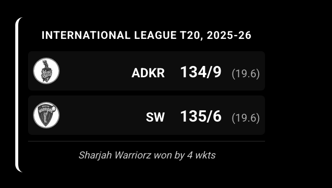

# MMM-Cricket-Live-Score

A [MagicMirror²](https://github.com/MagicMirrorOrg/MagicMirror) module to display live cricket scores with team logos in a beautiful scoreboard format.


## Features

- 🏏 **Live Cricket Scores** - Real-time updates from Cricbuzz via RapidAPI
- 🖼️ **Team Logos** - Displays team logos fetched from Cricbuzz
- 📊 **Professional Scoreboard** - Clean, compact design with match status
- ⚡ **Auto-refresh** - Configurable update intervals
- 🎨 **Modern UI** - Beautiful card-based layout with smooth animations

## Screenshots



## Installation

### Step 1: Clone the Repository

Navigate to your MagicMirror's `modules` folder and clone this repository:

```bash
cd ~/MagicMirror/modules
git clone https://github.com/souravj96/MMM-Cricket-Live-Score.git
```

### Step 2: Install Dependencies

```bash
cd MMM-Cricket-Live-Score
npm install
```

### Step 3: Get RapidAPI Key

1. Go to [RapidAPI Cricbuzz Cricket API](https://rapidapi.com/cricketapilive/api/cricbuzz-cricket/)
2. Sign up or log in to RapidAPI
3. Subscribe to the Cricbuzz Cricket API (free tier available)
4. Copy your API key from the API dashboard

## Configuration

Add the module to your `config/config.js` file:

```javascript
{
  module: "MMM-Cricket-Live-Score",
  position: "top_right", // or any other position
  config: {
    apiKey: "YOUR_RAPIDAPI_KEY_HERE", // Required: Your RapidAPI key
    updateInterval: 60000 // Optional: Update interval in milliseconds (default: 60000 = 1 minute)
  }
}
```

## Configuration Options

| Option | Type | Default | Description |
|--------|------|---------|-------------|
| `apiKey` | `string` | **Required** | Your RapidAPI key for Cricbuzz Cricket API |
| `updateInterval` | `number` | `60000` | How often to fetch new data (in milliseconds). Default is 1 minute. |

## Usage Example

```javascript
{
  module: "MMM-Cricket-Live-Score",
  position: "top_right",
  config: {
    apiKey: "5139c4b304msh75e2d838fbdc51ep13e78bjsn9b34e36fc005",
    updateInterval: 30000 // Update every 30 seconds
  }
}
```

## Display Information

The module displays:
- **Series Name** - Tournament or series name
- **Team Logos** - Circular team logos with borders
- **Team Names** - Short team names
- **Scores** - Runs/Wickets (Overs)
- **Match Status** - Current match status (Live, Completed, etc.)

## Features in Detail

### Live Score Updates
- Automatically fetches live cricket matches from Cricbuzz
- Updates at configurable intervals
- Displays multiple matches if available

### Team Logos
- Fetches team logos dynamically from Cricbuzz API
- Caches images to reduce API calls
- Displays as circular badges with borders

### Match Information
- Shows complete score details: runs, wickets, and overs
- Displays match status (In Progress, Completed, etc.)
- Shows "Yet to bat" for teams that haven't batted

## API Information

This module uses the [Cricbuzz Cricket API](https://rapidapi.com/cricketapilive/api/cricbuzz-cricket/) via RapidAPI.

**Endpoints Used:**
- `/matches/v1/live` - Fetches live match data
- `/img/v1/i1/c{imageId}/i.jpg` - Fetches team logos

## Troubleshooting

### Module not showing up
- Verify the module is in the `modules` folder
- Check that `npm install` was run successfully
- Ensure your API key is correct

### No scores displayed
- Check your API key is valid and has active subscription
- Verify there are live cricket matches happening
- Check browser console (F12) for errors

### Images not loading
- Ensure your RapidAPI subscription includes image access
- Check network connectivity
- Verify API rate limits haven't been exceeded

## Development

### File Structure
```
MMM-Cricket-Live-Score/
├── MMM-Cricket-Live-Score.js    # Main module file
├── node_helper.js               # Backend helper for API calls
├── cricket-live-score.css       # Styling
├── package.json                 # Dependencies
└── README.md                    # Documentation
```

### Contributing
Contributions are welcome! Please feel free to submit a Pull Request.

## Credits

- **Developer**: [Sourav Jana](https://github.com/souravj96)
- **API Provider**: [Cricbuzz Cricket API](https://rapidapi.com/cricketapilive/api/cricbuzz-cricket/) via RapidAPI
- **Framework**: [MagicMirror²](https://github.com/MagicMirrorOrg/MagicMirror)

## License

This project is licensed under the MIT License - see the [LICENSE](LICENSE) file for details.

## Changelog

### Version 1.0.0 (2025-12-23)
- Initial release
- Live cricket scores from Cricbuzz
- Team logo display
- Professional scoreboard UI
- Auto-refresh functionality
- Configurable update intervals

## Support

If you encounter any issues or have questions:
- Open an issue on [GitHub](https://github.com/souravj96/MMM-Cricket-Live-Score/issues)
- Check existing issues for solutions

## Acknowledgments

- Thanks to the MagicMirror² community
- Cricbuzz for providing cricket data
- RapidAPI for API infrastructure

---

**Enjoy your live cricket scores on your MagicMirror!** 🏏✨
